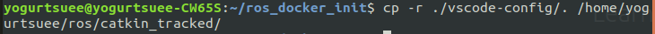
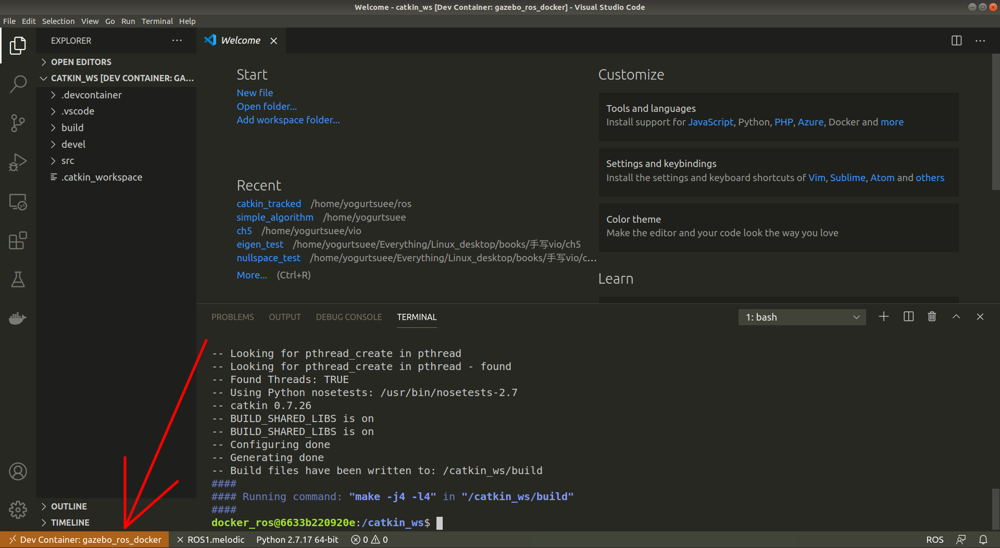
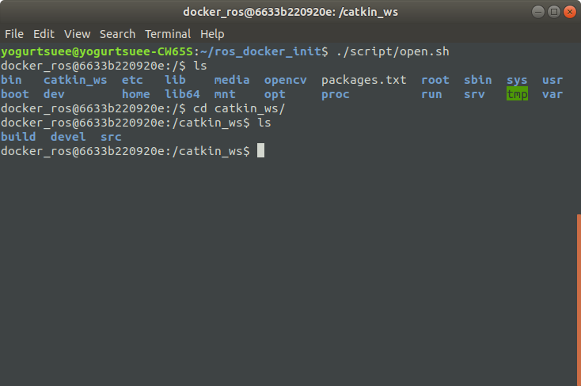

# ros-docker-vscode env config

## launch ros docker in vscode

get this script and run  

`cp -r ./vscode-config/. /your_catkin_ws`  

then launch docker env with ros  

after docker init in vscode   

then run `./script/open.sh` in ubuntu terminal to attach vscode docker   

## update ros images

export:   

`docker export -o xxx.tar container-id`  

import:  

`docker import xxx.tar image_name:version`  
